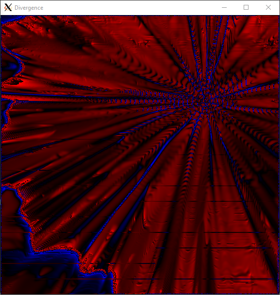

# Fluid Simulation on CUDA GPUs

## About
Simulation of Fast Fluid Dynamics on CUDA GPUs.
This is highly inspired (referenced) by the whitepaper presented in https://developer.nvidia.com/gpugems/gpugems/part-vi-beyond-triangles/chapter-38-fast-fluid-dynamics-simulation-gpu.
See report files in the `tex/` directory.

  

## Prerequisites
The following software libraries are needed to build:
- `opencv`
- `nvcc` (`cuda`)

A desktop environment is necessary to render fluid simulation windows,
otherwise, x-forwarding may be used.

This software has been developed for a linux (Debian) system with an
NVIDIA RTX 3060. No guarantees are made for other platforms/hardware.

## Building
To build the executable, simple run `make` in the root directory of this
repository.

## Execute
To execute, simply run the executable built in `bin/` after compilation. The Velocity Window is interactive, clicking within the window will trigger a velocity impulse at the mouse location. The Divergence and Pressure Window will reflect the computed scalar fields in real-time. 